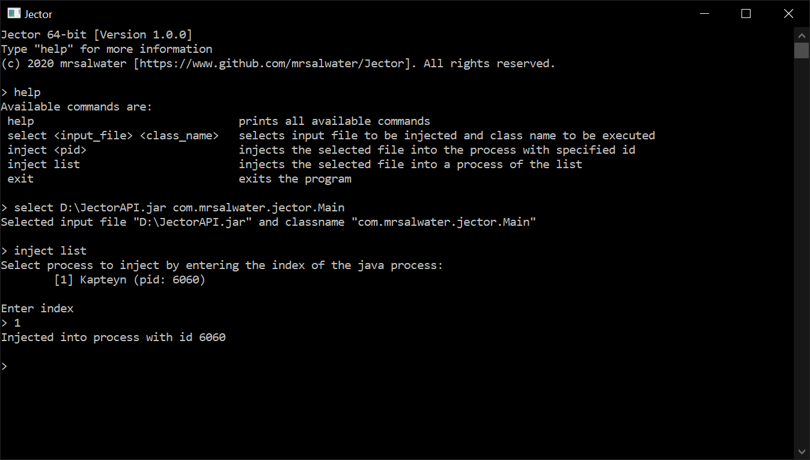

# Jector



## Overview

**Jector is a command line interface for injecting Java code externally into a JVM at runtime.**  
Jector loads a DLL file, which is a resource file included in the .exe, into memory, which then is injected through reflective dll injection into the JVM process. It uses the [JNI API](https://en.wikipedia.org/wiki/Java_Native_Interface) to load the specified jar dynamically with a classloader and to invoke the entry method.

## Download

| Version | x64 | x86 |
| :-----: |:---:|:---:|
| 1.0.0 | [Download](https://github.com/mrsalwater/Jector/releases/download/v1.0.0/Jector64.exe) | [Download](https://github.com/mrsalwater/Jector/releases/download/v1.0.0/Jector32.exe)  |

_Jector only supports Windows._

## How to use

### Creating a JAR

The class file version of the Jar files has to be supported by the target JVM.    
The Jar needs a entry point, which is defined in a class as follows:

````java
public static void entry() {
    /* ... */
}
````  

### Injecting the JAR

The command line interface needs the Jar path and the class name, which contains the entry point. The class name includes the full class path (e.g. com.mrsalwater.jector.Main). The information has to be passed by the following command:

````
> select <jar path> <class name>
````

To inject the jar the host process has to be specified. This can be either done by passing the process id:

````
> inject <pid>
````

Or by selecting a listed JVM process (e.g.):

````
> inject list
Select process to inject by entering the index of the java process:
        [1] D3DFocusWindow (pid: 2760)
        [2] Minecraft server (pid: 2332)
        [3] Java Decompiler (pid: 9068)
        [4] Kapteyn (pid: 14340)

Enter index
> 3
Injected into process with id 9068
```` 

## References

* [ReflectiveDLLInjection](https://github.com/stephenfewer/ReflectiveDLLInjection)  
    "Reflective DLL injection is a library injection technique in which the concept of reflective programming is employed to perform the loading of a library from memory into a host process"  
    Author: Stephen Fewer   
    It is licensed under a [3 clause BSD license](https://github.com/stephenfewer/ReflectiveDLLInjection/blob/master/LICENSE.txt)

---

_This software is licensed under the [MIT License](https://opensource.org/licenses/MIT)_  
_Copyright 2020 mrsalwater_